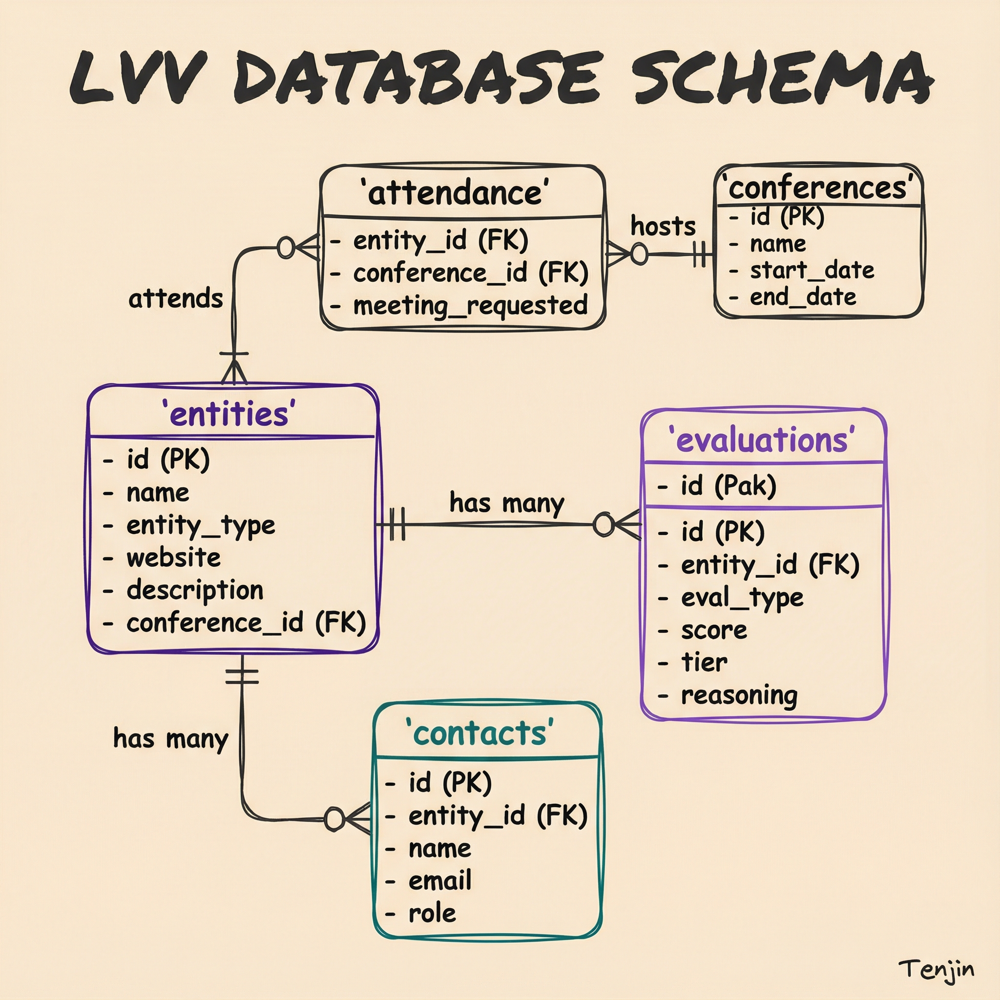

# LVV Database Schema Reference

Complete database schema for the LVV Intelligence Platform.

**Database Location:** `~/.lvv/intelligence.db` (SQLite)



---

## Quick Reference: Adding Entities

### Via SQL (Recommended for Manual Adds)

```sql
INSERT INTO entities (name, normalized_name, entity_type, website, source, conference_id, created_at, updated_at)
VALUES
('Company Name', 'companyname', 'company', 'https://example.com', 'JPM 2025', 1, datetime('now'), datetime('now'));
```

**Required fields:**
- `name` - Display name
- `normalized_name` - Lowercase, no spaces/punctuation (for matching)
- `entity_type` - One of: `company`, `investor`, `individual`, `organization`

**Important fields:**
- `conference_id` - FK to conferences table (use 1 for JPM 2025)
- `source` - How entity was added (conference name, "manual", "crm_import")
- `website` - Primary URL (domain extracted automatically for matching)

### Via CLI Ingest

```bash
lvv conference ingest --conference "JPM 2025" --file data.csv --type company
```

**Note:** CSV format must match expected columns. Check existing conference data for format.

---

## Core Tables

### entities

Primary table for companies, investors, individuals, and organizations.

| Column | Type | Required | Description |
|--------|------|----------|-------------|
| `id` | INTEGER | Auto | Primary key |
| `name` | TEXT | Yes | Display name |
| `normalized_name` | TEXT | Yes | Lowercase for matching |
| `entity_type` | TEXT | Yes | `company`, `investor`, `individual`, `organization` |
| `website` | TEXT | No | Primary URL |
| `domain` | TEXT | No | Extracted from website |
| `email` | TEXT | No | Primary email |
| `phone` | TEXT | No | Primary phone |
| `city` | TEXT | No | City location |
| `country` | TEXT | No | Country |
| `metadata` | JSON | No | Type-specific fields |
| `description` | TEXT | No | Entity description |
| `source` | TEXT | No | Origin (conference name, "manual") |
| `conference_id` | INTEGER | No | FK to conferences |
| `crm_id` | TEXT | No | Dialllog/HubSpot ID |
| `is_archived` | INTEGER | No | Default 0 |
| `is_deleted` | INTEGER | No | Default 0 |
| `created_at` | TIMESTAMP | Auto | Creation time |
| `updated_at` | TIMESTAMP | Auto | Last update (trigger) |

**Indexes:** `normalized_name`, `domain`, `entity_type`, `crm_id`, `source`

### evaluations

Stores AI-generated evaluations for entities.

| Column | Type | Required | Description |
|--------|------|----------|-------------|
| `id` | INTEGER | Auto | Primary key |
| `entity_id` | INTEGER | Yes | FK to entities |
| `evaluation_type` | TEXT | Yes | `prescreen`, `full_evaluation` |
| `evaluator_model` | TEXT | No | `opus-4`, `haiku-4`, etc. |
| `scores` | JSON | No | `{dimension: score, ...}` |
| `overall_score` | REAL | No | Weighted average |
| `tier` | TEXT | No | `Tier 1-4` or `Accept/Maybe/Pass` |
| `reasoning` | TEXT | No | Detailed reasoning |
| `strengths` | TEXT | No | Key strengths |
| `concerns` | TEXT | No | Key concerns |
| `recommendation` | TEXT | No | Final recommendation |
| `conference` | TEXT | No | Triggering conference |
| `web_search_performed` | INTEGER | No | Default 0 |
| `web_search_data` | JSON | No | Tavily results |
| `status` | TEXT | No | `completed`, `failed`, `in_progress` |
| `input_tokens` | INTEGER | No | Token count |
| `output_tokens` | INTEGER | No | Token count |
| `estimated_cost` | REAL | No | Cost in dollars |
| `created_at` | TIMESTAMP | Auto | Evaluation time |

**Indexes:** `entity_id`, `tier`, `conference`, `created_at`

### conferences

Conference metadata.

| Column | Type | Required | Description |
|--------|------|----------|-------------|
| `id` | INTEGER | Auto | Primary key |
| `name` | TEXT | Yes | Unique name (e.g., "JPM 2025") |
| `short_name` | TEXT | No | Abbreviation |
| `start_date` | DATE | No | Conference start |
| `end_date` | DATE | No | Conference end |
| `location` | TEXT | No | City, State/Country |
| `url` | TEXT | No | Conference website |

### attendance

Links entities to conferences with meeting tracking.

| Column | Type | Required | Description |
|--------|------|----------|-------------|
| `entity_id` | INTEGER | Yes | FK to entities |
| `conference_id` | INTEGER | Yes | FK to conferences |
| `meeting_requested` | INTEGER | No | 0/1 flag |
| `meeting_request_date` | TIMESTAMP | No | When requested |
| `meeting_scheduled` | INTEGER | No | 0/1 flag |
| `meeting_date` | TIMESTAMP | No | Scheduled time |
| `meeting_outcome` | TEXT | No | Result notes |
| `is_presenting` | INTEGER | No | 0/1 flag |
| `presentation_title` | TEXT | No | Talk title |
| `booth_number` | TEXT | No | Booth location |

**Unique constraint:** `(entity_id, conference_id)`

### contacts

Individual people associated with entities.

| Column | Type | Required | Description |
|--------|------|----------|-------------|
| `id` | INTEGER | Auto | Primary key |
| `name` | TEXT | Yes | Full name |
| `email` | TEXT | No | Email address |
| `phone` | TEXT | No | Phone number |
| `role` | TEXT | No | Job title |
| `entity_id` | INTEGER | No | FK to entities |
| `linkedin_url` | TEXT | No | LinkedIn profile |
| `is_key_contact` | INTEGER | No | Primary contact flag |
| `has_assistant` | INTEGER | No | Has assistant flag |
| `assistant_name` | TEXT | No | Assistant name |
| `assistant_email` | TEXT | No | Assistant email |

### match_candidates

Potential duplicate entity matches.

| Column | Type | Required | Description |
|--------|------|----------|-------------|
| `entity_id` | INTEGER | Yes | First entity |
| `candidate_entity_id` | INTEGER | Yes | Second entity |
| `confidence` | REAL | Yes | 0.0 to 1.0 |
| `match_strategy` | TEXT | Yes | `url_exact`, `domain`, `normalized_name`, `fuzzy` |
| `status` | TEXT | No | `pending`, `confirmed`, `rejected`, `merged` |
| `merged_into_entity_id` | INTEGER | No | Winner if merged |

### relationships

Entity-to-entity relationships.

| Column | Type | Required | Description |
|--------|------|----------|-------------|
| `from_entity_id` | INTEGER | Yes | Source entity |
| `to_entity_id` | INTEGER | Yes | Target entity |
| `relationship_type` | TEXT | Yes | `investor`, `portfolio_company`, `partner`, `advisor` |
| `is_active` | INTEGER | No | Default 1 |
| `start_date` | DATE | No | Relationship start |
| `end_date` | DATE | No | Relationship end |

### activities

Activity log for entities and contacts.

| Column | Type | Required | Description |
|--------|------|----------|-------------|
| `activity_type` | TEXT | Yes | `email`, `meeting`, `call`, `note`, `evaluation` |
| `entity_id` | INTEGER | No | FK to entities |
| `contact_id` | INTEGER | No | FK to contacts |
| `subject` | TEXT | No | Activity subject |
| `description` | TEXT | No | Details |
| `outcome` | TEXT | No | Result |
| `activity_date` | TIMESTAMP | No | When it happened |

### tags / entity_tags

Tagging system for entities.

```sql
-- Create a tag
INSERT INTO tags (name, category) VALUES ('senolytics', 'therapeutic_area');

-- Tag an entity
INSERT INTO entity_tags (entity_id, tag_id) VALUES (123, 1);
```

---

## Useful Views

### latest_evaluations

Most recent evaluation per entity.

```sql
SELECT * FROM latest_evaluations WHERE entity_id = 123;
```

### entities_with_evaluations

Entities joined with their latest evaluation.

```sql
SELECT name, overall_score, tier, days_since_evaluation
FROM entities_with_evaluations
WHERE entity_type = 'company' AND tier = 'Accept';
```

### pending_matches

Unresolved duplicate candidates.

```sql
SELECT entity_name, candidate_name, confidence
FROM pending_matches
ORDER BY confidence DESC;
```

### conference_attendees

Entities attending conferences with scores.

```sql
SELECT * FROM conference_attendees
WHERE conference_name = 'JPM 2025'
ORDER BY overall_score DESC;
```

---

## Common Queries

### Add entity with attendance

```sql
-- Insert entity
INSERT INTO entities (name, normalized_name, entity_type, source, conference_id, created_at, updated_at)
VALUES ('Acme Bio', 'acmebio', 'company', 'JPM 2025', 1, datetime('now'), datetime('now'));

-- Link to conference
INSERT INTO attendance (entity_id, conference_id, meeting_requested)
VALUES (last_insert_rowid(), 1, 1);
```

### Update meeting status

```sql
UPDATE attendance
SET meeting_scheduled = 1, meeting_date = '2025-01-14 10:00:00'
WHERE entity_id = 123 AND conference_id = 1;
```

### Find entities without evaluations

```sql
SELECT e.id, e.name, e.entity_type
FROM entities e
LEFT JOIN evaluations ev ON e.id = ev.entity_id
WHERE ev.id IS NULL AND e.entity_type = 'company';
```

### Get evaluation history for entity

```sql
SELECT evaluation_type, overall_score, tier, created_at
FROM evaluations
WHERE entity_id = 123
ORDER BY created_at DESC;
```

### Count by tier

```sql
SELECT tier, COUNT(*) as count
FROM latest_evaluations
GROUP BY tier
ORDER BY count DESC;
```

---

## Normalization Rules

For `normalized_name` field:
1. Lowercase all characters
2. Remove spaces
3. Remove punctuation (commas, periods, hyphens)
4. Remove common suffixes (Inc, LLC, Ltd, Corp)

Examples:
- "Acme Bio, Inc." → `acmebio`
- "Samsung Venture Investment Corporation" → `samsungventureinvestmentcorporation`
- "ARPA-H" → `arpah`

---

## Entity Types

| Type | Description | Example |
|------|-------------|---------|
| `company` | Companies being evaluated | Calico, Rejuvenate Bio |
| `investor` | VCs, family offices, angels | NEA, Methuselah Fund |
| `individual` | People not tied to entities | Advisors, consultants |
| `organization` | Non-profits, gov agencies | ARPA-H, ADDF |

---

## Conference IDs

| ID | Name | Date |
|----|------|------|
| 1 | JPM 2025 | 2025-01-13 |

---

**Last Updated:** 2025-12-22
