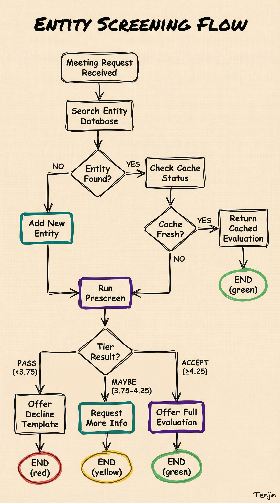

# EntityScreening Workflow

**Trigger:** "Screen [ENTITY]", "Evaluate [COMPANY]", "Check [INVESTOR]"



---

## Execution Steps

### Step 1: Find Entity

```bash
lvv entity search "ENTITY_NAME"
```

If multiple matches, present list and ask user to confirm.

**If entity not found and this is a meeting request:**
1. Add entity to database (see DatabaseSchema.md for SQL)
2. Continue to Step 1b

### Step 1b: Capture Contact (if meeting request)

If the request includes contact information, store it:

```sql
INSERT INTO contacts (name, email, role, entity_id, is_key_contact, created_at, updated_at)
VALUES (
  'Contact Name',
  'email@company.com',
  'CEO/Founder/BD',
  <entity_id>,
  1,  -- is_key_contact
  datetime('now'),
  datetime('now')
);
```

**Extract from meeting request:**
- Name (usually in signature)
- Email
- Role/Title
- Assistant info if mentioned

### Step 1c: Log Meeting Request

If this is an inbound meeting request, track it:

```sql
INSERT INTO attendance (entity_id, conference_id, meeting_requested, meeting_request_date)
VALUES (<entity_id>, <conference_id>, 1, datetime('now'))
ON CONFLICT(entity_id, conference_id) DO UPDATE SET
  meeting_requested = 1,
  meeting_request_date = datetime('now');
```

**Conference IDs:** 1 = JPM 2025, 2 = Biotech Showcase 2025

### Step 2: Check Existing Evaluation

Look at search output for:
- Last evaluation date
- Current score and tier
- Cache status

### Step 3: Determine Evaluation Type

**Ask user if not specified:**

| Type | Model | Cost | Use Case |
|------|-------|------|----------|
| Prescreen | Haiku | $0.0007 | Quick triage, initial filter |
| Full Eval | Opus | ~$0.30 | Deep analysis, final decision |

### Step 4: Handle Cached Results

**If evaluated <30 days ago:**
```
Entity 'Acme Bio' was last evaluated X days ago
Score: 6.2, Tier: Tier 2

Use cached result or re-evaluate?
[1] Use cached (free)
[2] Re-evaluate (~$0.30)
```

**Decision logic:**
- <30 days: Offer cache (default)
- 30-180 days: Ask user preference
- >180 days: Recommend re-evaluation

### Step 5: Run Evaluation

**Prescreen:**
```bash
lvv screen prescreen <entity_id>
```

**Full Evaluation:**
```bash
lvv screen full <entity_id>
```

### Step 6: Display Results

**For Companies (8 dimensions):**

| Dimension | Score | Notes |
|-----------|-------|-------|
| Quality of Science | X/10 | [reasoning] |
| Level of Evidence | X/10 | [reasoning] |
| Geroscience Fit (2x) | X/10 | [reasoning] |
| Proof of Concept | X/10 | [reasoning] |
| Team | X/10 | [reasoning] |
| Investment Terms | X/10 | [reasoning] |
| Platform Potential | X/10 | [reasoning] |
| Competitive MOAT | X/10 | [reasoning] |

**Weighted Average:** X.X → **[TIER]**

**For Investors (5 dimensions):**

| Dimension | Score | Notes |
|-----------|-------|-------|
| Stage Alignment | X/10 | [reasoning] |
| Therapeutic Focus | X/10 | [reasoning] |
| Geographic Fit | X/10 | [reasoning] |
| Strategic Value | X/10 | [reasoning] |
| Activity Level | X/10 | [reasoning] |

**Average:** X.X → **Tier [1-4]**

### Step 7: Offer Next Steps

**For Accept/Maybe tier:**
- Schedule meeting (update attendance table)
- Evaluate related entities (same conference, similar focus)
- Export this evaluation
- Compare with similar entities

**For Pass tier:**
- Generate decline response (see `DeclineTemplates.md`)
- Common decline reasons:
  - No geroscience fit
  - Wrong stage (too early/late)
  - Medical device (not therapeutic)
  - Valuation concern
  - Geographic mismatch
- Add notes explaining decision

---

## Scoring Reference

### Company Tiers
- **Accept** (≥4.25): Schedule meeting, prioritize
- **Maybe** (3.75-4.25): Review further, conditional interest
- **Pass** (<3.75): Not a fit for current thesis

### Investor Tiers
- **Tier 1** (≥7.0): Strong strategic fit, prioritize relationship
- **Tier 2** (≥5.0): Good potential, worth meeting
- **Tier 3** (≥3.0): Possible future interest
- **Tier 4** (<3.0): Not aligned with LVV

---

## Example Execution

```
User: "Screen Rejuvenation Bio"

Claude: [Runs: lvv entity search "Rejuvenation Bio"]

        Found: Rejuvenation Bio (ID: 456)
        Type: Company
        Last evaluated: 45 days ago (Score: 7.2, Tier: Tier 1)

        Use cached result or re-evaluate?
        [1] Use cached (free)
        [2] Re-evaluate (~$0.30)

User: 1

Claude: REJUVENATION BIO - Evaluation Summary

        Overall Score: 7.2/10 → Tier 1 (Accept)

        | Dimension | Score |
        |-----------|-------|
        | Quality of Science | 8 |
        | Level of Evidence | 7 |
        | Geroscience Fit (2x) | 9 |
        | ... | ... |

        Key Strengths:
        - Strong geroscience alignment
        - Experienced team from Calico

        Recommendation: Schedule meeting at JPM 2025
```

---

## Error Handling

| Error | Cause | Fix |
|-------|-------|-----|
| `Entity not found` | Not in database | `lvv conference ingest` or manual add |
| `Evaluation failed` | API error | Check API key, retry |
| `Rate limit` | Too many requests | Wait 30s (auto-handled) |
